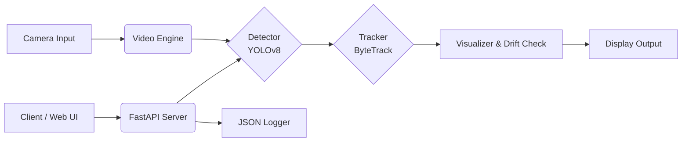

# 👁️ Edge AI Video Analytics System


## 📖 Overview

This project is developed as a technical assessment for the **Dataguess AI Field Application Engineer** position. It demonstrates a production-grade, end-to-end **Edge AI Pipeline** capable of real-time object detection and tracking.

The system is designed to simulate a real-world edge computing scenario, featuring:

- **Training:** Custom training on the challenging **VisDrone** dataset with advanced augmentations.
- **Optimization:** Model compression via ONNX and TensorRT (FP16/INT8) pipelines.
- **Inference:** Multi-threaded, low-latency video processing engine.
- **Deployment:** REST API with a modern Web UI and Docker support.

---

## 🏗️ System Architecture

The project follows a modular "Loose Coupling" architecture to ensure stability and scalability suitable for Edge devices.



## 🛠️ Tech Stack

- **Core AI:** PyTorch, Ultralytics YOLOv8
- **Optimization:** ONNX Runtime (GPU/CPU), TensorRT
- **Backend:** FastAPI, Uvicorn
- **Tracking:** ByteTrack
- **Computer Vision:** OpenCV
- **Monitoring:** Custom JSON Logger, Pynvml
- **DevOps:** Docker, Git

---

## 📂 Project Structure

```
cv-advanced-assessment/
├── training/           # Training scripts, augmentations, and logs
├── optimization/       # Scripts for ONNX/TensorRT conversion & benchmarking
├── inference/          # Core logic: Detector, Tracker, VideoEngine, Fusion
├── api/                # FastAPI server, Web UI templates, Dockerfile
├── monitoring/         # GPU monitoring, FPS metering, Logger
├── tests/              # Unit tests for system integrity
├── models/             # Storage for .pt, .onnx, and .engine files
└── requirements.txt    # Python dependencies
```

---

## 🚀 Installation & Setup

### **Prerequisites**

- Python 3.8 or higher
- NVIDIA GPU (Recommended)
- CUDA Toolkit (for GPU acceleration)

### **1. Clone the Repository**

```bash
git clone https://github.com/Delilt/cv-advanced-assessment.git
cd cv-advanced-assessment
```

### **2. Install Dependencies**

```bash
pip install -r requirements.txt
```

---

## 💻 Usage Guide

### **1️⃣ Model Training**

Train YOLOv8 on the VisDrone dataset:

```bash
cd training
python train.py
```

Output: `models/latest.pt`

### **2️⃣ Model Optimization**

Convert PyTorch → ONNX:

```bash
cd optimization
python export_to_onnx.py
```

Output: `models/latest.onnx`

### **3️⃣ Real-Time Video Engine**

```bash
cd inference
python video_engine.py
```

Features: FPS counter, bounding boxes, track IDs.

### **4️⃣ API Server & Web Dashboard**

```bash
uvicorn api.server:app --reload
```

- UI: [http://127.0.0.1:8000](http://127.0.0.1:8000)
- Swagger: [http://127.0.0.1:8000/docs](http://127.0.0.1:8000/docs)

---

## 🐳 Docker Deployment

### **Build the Image**

```bash
docker build -t dataguess-edge-ai -f api/docker/Dockerfile .
```

### **Run the Container**

```bash
docker run --gpus all -p 8000:8000 dataguess-edge-ai
```

---

## 📊 Performance & Results

Benchmarks on **RTX 3050 Laptop GPU**:

| Metric         | Result  | Notes                            |
| -------------- | ------- | -------------------------------- |
| mAP@50         | 24.9%   | VisDrone, YOLOv8 Nano, 10 Epochs |
| Inference Time | 15–30ms | ONNX Runtime                     |
| Throughput     | 30+ FPS | Real-time                        |
| Classes        | 8       | Pedestrian, Car, Bus, Truck…     |

---

## ✅ Unit Tests

```bash
pytest
```

---

## 👤 Author

**Delil Temel**
AI Field Application Engineer Candidate
